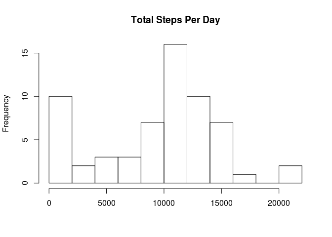
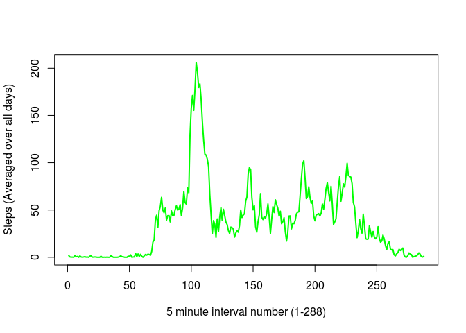
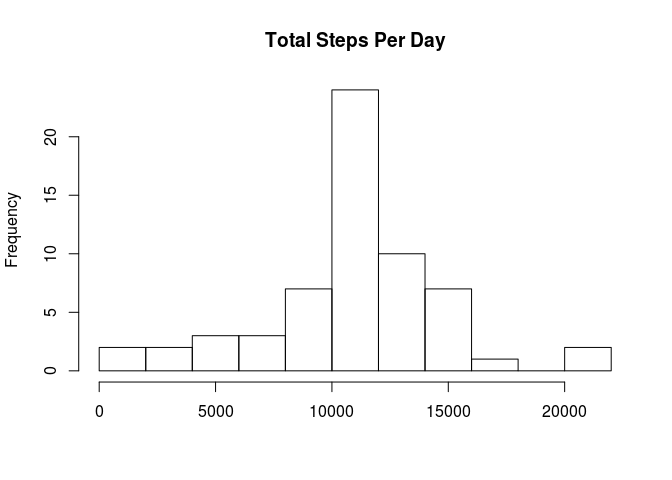
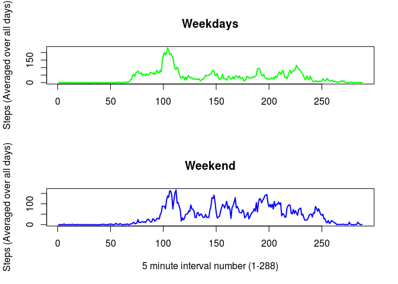

# Reproducible Research: Peer Assessment 1

## Loading and preprocessing the data


```r
# Load data
f <- read.csv("activity.csv", header = TRUE)
suppressMessages(library(dplyr)) # load dplyr without output  
# Place in dplyr table and add column corresponding to which of the 288 5-minute daily intervals the row belongs
t <- mutate(tbl_df(f), interval_num = (row_number() - 1) %% 288 + 1)
```


## What is mean total number of steps taken per day?


```r
# Calculate the total number of steps taken per day:
d <- group_by(t, date) %>%    
  summarise(total_steps = sum(steps, na.rm=TRUE))
# histogram of the total number of steps taken each day
hist(d$total_steps, breaks = 10,main="Total Steps Per Day",xlab="")
```

 


```r
# Calculate and report the mean and median of the total number of steps taken per day
summarise(d, Mean=mean(total_steps), Median=median(total_steps))
```

```
## Source: local data frame [1 x 2]
## 
##      Mean Median
## 1 9354.23  10395
```


## What is the average daily activity pattern?


```r
# Make a time series plot of the 5 �minute interval and the average number of
# steps taken, averaged across all days 
i <- group_by(t, interval_num) %>%    
  summarise(avg_steps = mean(steps, na.rm=TRUE))

plot(i$interval, i$avg_steps, type="l", xlab= "5 minute interval number (1-288)", ylab= "Steps (Averaged over all days)", col="green" , lwd=2)
```

 

5 minute interval, on average across all days with maximun steps:

```r
# Which 5 minute interval, on average across all the days in the dataset, contains the maximum numberof steps?
filter(i, avg_steps == max(avg_steps))
```

```
## Source: local data frame [1 x 2]
## 
##   interval_num avg_steps
## 1          104  206.1698
```


## Inputing missing values

The number of rows in the dataset with missing values:

```r
#Calculate and report the total number of missing values in the dataset
nrow(filter(t, is.na(steps)))
```

```
## [1] 2304
```

For the remaining analysis we will replace any missing values with the average step count for that particular 5-minute interval.

```r
# Create a new dataset that is equal to the original dataset but with the missing data filled in.
# Join with averages already created above to get the value for use in place of the missing value
tFilled <- inner_join(t, i, by = "interval_num")  %>% 
    transform(steps = ifelse(is.na(steps), avg_steps, steps))

dFilled <- group_by(tFilled, date) %>%    
  summarise(total_steps = sum(steps, na.rm=TRUE))

# histogram of the total number of steps taken each day for missing-value-filled data
hist(dFilled$total_steps, breaks = 10, main="Total Steps Per Day", xlab="")
```

 


```r
# Calculate and report the mean and median of the total number of steps taken per day on missing-value-filled data
summarise(dFilled, Mean=mean(total_steps), Median=median(total_steps))
```

```
## Source: local data frame [1 x 2]
## 
##       Mean   Median
## 1 10766.19 10766.19
```


Notice the above values differ form the previous analysis with the missing values.  We see the missing data skews 
the average daily number of steps lower.  Inputing missing data gives what is likely a truer picture of reality.


## Are there differences in activity patterns between weekdays and weekends?


```r
# Add day of week field
tFilled <- mutate(tFilled, dow = weekdays(as.Date(tFilled$date)))

# Extract weekdays from dataset
days <- filter(tFilled, ! dow %in% c("Saturday", "Sunday")) %>%
  group_by(interval_num) %>%    
  summarise(avg_steps = mean(steps))

#Extract weekends from dataset
end <- filter(tFilled, dow %in% c("Saturday", "Sunday")) %>%
  group_by(interval_num) %>%    
  summarise(avg_steps = mean(steps))

attach(mtcars)
par(mfrow=c(2,1)) 
plot(days$interval, days$avg_steps, type="l", main="Weekdays", xlab= "", ylab= "Steps (Averaged over all days)", col="green" , lwd=2)
plot(end$interval, end$avg_steps, type="l", main="Weekend", xlab= "5 minute interval number (1-288)", ylab= "Steps (Averaged over all days)", col="blue" , lwd=2)
```

 

Note there are indeed differences in activity patterns between weekdays and weekends.


